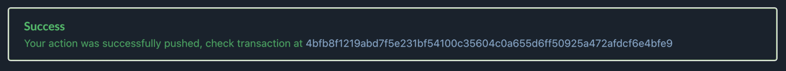
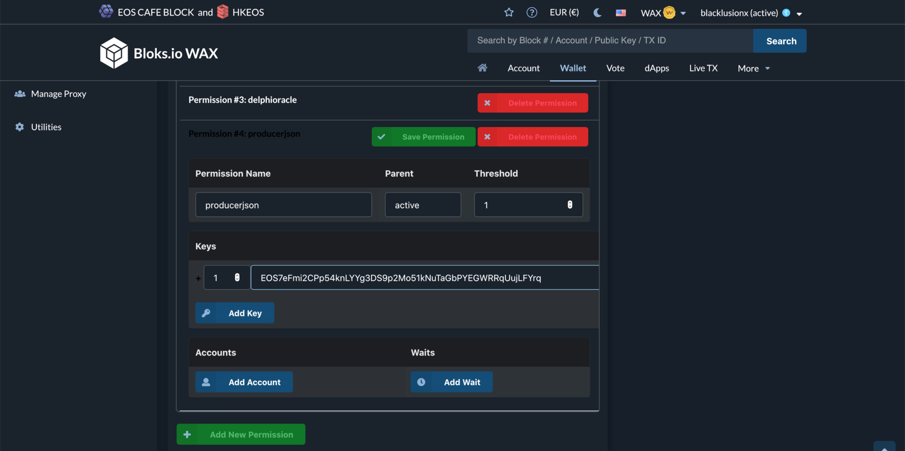
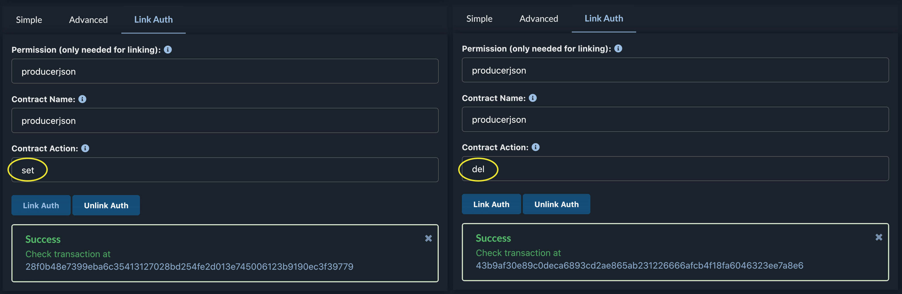

# Die bp.json auf die Chain pushen
Wenn Sie Ihre [bp.json](/de/erste-schritte/bp-json) erfolgreich erstellt und gehostet haben, ist der nächste Schritt, diese bp.json auf die Chain zu pushen. Wenn Sie noch keine bp.json haben, können Sie sich unsere Anleitung zur Erstellung einer bp.json [hier](/de/erste-schritte/bp-json) ansehen.

## Warum die bp.json auf die Chain pushen?
Bp.jsons, die auf der Chain veröffentlicht werden, bieten ein paar Vorteile gegenüber denen, die auf einer Website gehostet werden:

Die bp.json ist auch dann noch verfügbar, wenn die Website vorübergehend offline ist. Dapps können alle producerjsons leicht an einem einzigen Ort finden. Die Signatur vom Konto des Blockproducers bietet eine Verifizierung der bp.json und Veränderung können über die Chain eingesehen werden.

## Folgendes wird benötigt
- Die [bp.json](/de/erste-schritte/bp-json) für WAX
- Entweder
    - Eine Cleos Instanz
    - Alternativ kann auch bloks.io verwendet werden

## 1. Mit Cleos pushen
Wenn Sie Cleos auf Ihrem Rechner installiert haben und entweder den active oder owner Key (mehr dazu später) zu Ihrer Wallet hinzugefügt haben, können Sie den producerjson mit einem einzigen Befehl pushen.

### Variables:
- **URL** = (optionally) Wenn Sie Probleme haben, eine Verbindung zu einer lokalen Node herzustellen oder keine Node lokal gehostet haben, verwenden Sie diese Option mit einem der öffentlich verfügbaren Endpunkte:
e.g ```-u https://wax.blacklusion.io```
- **OWNER** = Accountname des Producers:
e.g. ```blacklusionx```
- **FILE** = Dateiname der bp.json:
e.g. ```wax.json```
- **KEY** = Name des Keys der für die authentifizierung verwenden werden soll
e.g ```active``` or ```producerjson```

```bash
cleos URL push action producerjson set '{"owner":"OWNER", "json": "'printf %q $(cat FILE | tr -d "\r")'"}' -p OWNER@KEY
```

Ersetzen Sie einfach die Variablen durch Ihre Werte. In unserem Fall würden wir also den producerjson mit diesem Befehl pushen.

```bash
cleos -u https://wax.blacklusion.io push action producerjson set '{"owner":"blacklusionx", "json": "'printf %q $(cat wax.json | tr -d "\r")'"}' -p blacklusionx@producerjson
```

## 2. Über bloks.io pushen
Gerade für den Anfang ist books.io eine gute Option, da es einen benutzerfreundlicheren Weg als ein CLI-Befehl bietet.

### Wähle den Producerjson smartcontract:
Hier klicken [link](https://wax.bloks.io/account/producerjson?loadContract=true&tab=Actions&account=producerjson&scope=producerjson&limit=100&action=set) to access the producerjson smartcontract.


### Die Informationen ausfüllen und bestätigen
Wählen Sie "set" und geben Sie Ihre Informationen ein. Als Kontoname verwenden Sie einfach den Kontonamen, mit dem Sie den Producer registriert haben, und für das json-Feld kopieren Sie einfach den aktuellen Inhalt Ihrer bp.json. Verwenden Sie hier nicht die URL zu Ihrer gehosteten bp.json. Klicken Sie abschließend auf "Submit Transaction" und wählen Sie die Wallet Ihrer Wahl aus.


Wenn Sie alles richtig gemacht haben, wird bloks.io Ihre erfolgreiche Transaktion bestätigen. Sie können einen Blick auf diese Beispieltransaktion werfen [here](https://wax.bloks.io/transaction/4bfb8f1219abd7f5e231bf54100c35604c0a655d6ff50925a472afdcf6e4bfe9).



## Custom permission

Für zusätzliche Sicherheit oder wenn Sie die bp.json häufig pushen müssen, empfehlen wir dringend, einen dedizierten Key für das Pushen der bp.json zu verwenden. Dies verhindert, dass der Key (oder welches Skript oder welche Person auch immer) andere Aktionen ausführen kann.

Unser komplettes Tutorial, das die Erstellung von benutzerdefinierten Berechtigungen behandelt, finden Sie hier. Die folgenden Bilder zeigen Ihnen, welche Informationen Sie ausfüllen müssen, um das producerjson-Recht einzurichten.




## Hilfreiche Links
- Bloks.io: https://wax.bloks.io
- Tool um die bp.json zu überprüfen: https://validate.eosnation.io/wax/producers/
- bp.json tutorial: https://docs.blacklusion.io/#/de/erste-schritte/bp-json
