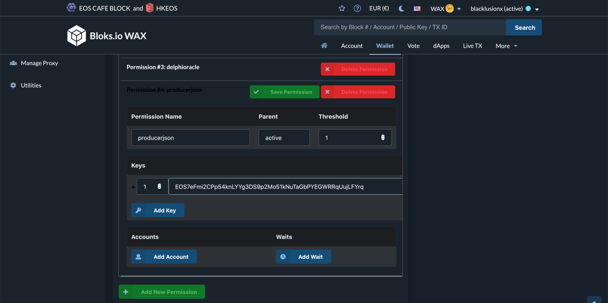
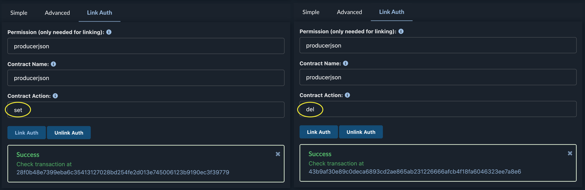

# Pushing the bp.json on-chain

If you have successfully created and hosted your bp.json, the next step would be to push that bp.json on-chain. If you do not have your bp.json yet, you can check out our tutorial on how to create one here.

## Why push on-chain?
Bp.jsons that are published on-chain offer a couple of benefits over those that are hosted on a website:

The bp.json will still be available even if the website is temporarily offline. Dapps can easily find all producerjsons in a single place. The signature from the block producer’s account offers verification of the bp.json and history with more insights about the changes in a producerjson is provided.

## What you will need
- Your bp.json for WAX (Tutorial here)
- Either
    - Cleos installed on your machine
    - Or you can use bloks.io

## 1. Pushing via Cleos
If you have Cleos installed on your machine and have added either your active or custom permission key (more on this later) to your wallet you can push the producerjson with a single command.

### Variables:
- **URL** = (optionally) If you have problems connecting to a local node or don’t have hosted a node locally, use this option with one of the publicly available endpoints:
e.g ```-u https://wax.blacklusion.io```
- **OWNER** = Account name of producer:
e.g. ```blacklusionx```
- **FILE** = Filename of producerjson. You will have to:
e.g. ```wax.json```
- **KEY** = The name of you want to use for authentication:
e.g ```active``` or ```producerjson```

```bash
cleos URL push action producerjson set '{"owner":"OWNER", "json": "'printf %q $(cat FILE | tr -d "\r")'"}' -p OWNER@KEY
```

Just substitute the variables with your values. So in our case, we would push the producerjson with this command.

```bash
cleos -u https://wax2.blacklusion.io push action producerjson set '{"owner":"blacklusionx", "json": "'printf %q $(cat wax.json | tr -d "\r")'"}' -p blacklusionx@producerjson
```

## 2. Pushing via bloks.io
Especially when you are starting out, books.io is a great option, since it offers a more user friendly way than a CLI-Command.

### Go to the producerjson contract:
Click on this [link](https://wax.bloks.io/account/producerjson?loadContract=true&tab=Actions&account=producerjson&scope=producerjson&limit=100&action=set) to access the producerjson smartcontract.


### Fill out the information and submit
Select “set” and fill in your information. As account name just use the account name you have registered producer with and for the json field just copy the actual content of your bp.json. Don’t use the URL to your hosted bp.json here. Finally click on “Submit Transaction” and choose your wallet of choice.


If you have done everything correctly bloks.io will confirm your successful transaction. You can have a look at this sample transaction [here]("https://wax.bloks.io/transaction/4bfb8f1219abd7f5e231bf54100c35604c0a655d6ff50925a472afdcf6e4bfe9").


## Custom permission

For added security or if you often have to push the bp.json, we highly recommend using a dedicated key for pushing the bp.json. This prevents the key (or whatever script or person gets hold of it) to execute other actions.

You can find our full tutorial, covering how to create custom permissions here. The following pictures will show you which information you have to fill in, in order to set up the producerjson permission.




## Helpful Links
- Bloks.io: https://wax.bloks.io
- Tool to validate your bp.json: https://validate.eosnation.io/wax/producers/
- bp.json tutorial: https://docs.blacklusion/#/en/getting-started/bp_json
